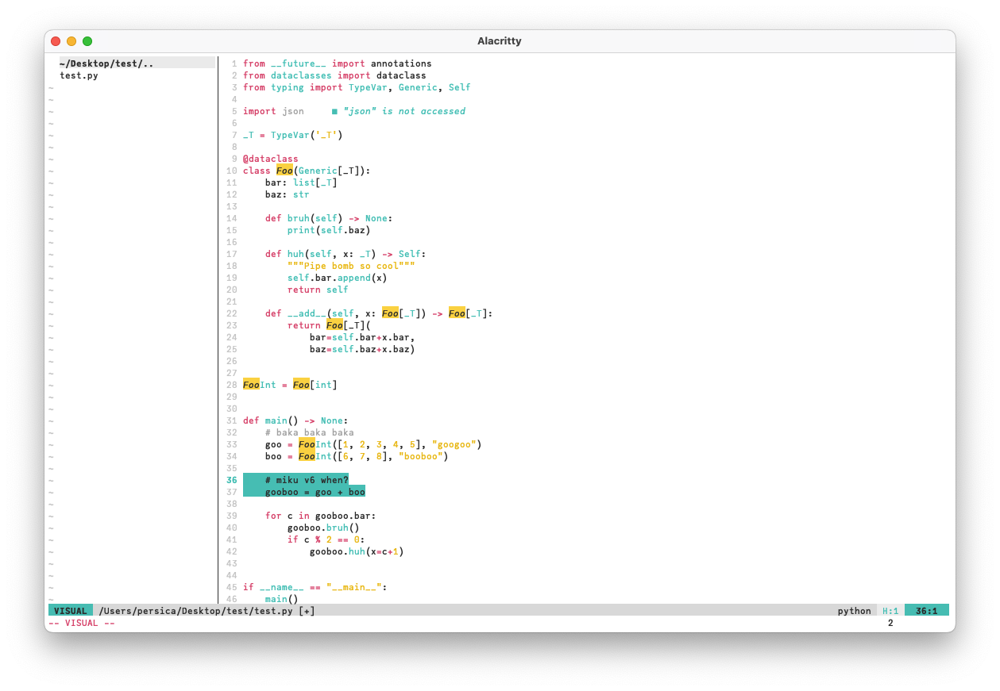

# Triple Baka

A light neovim theme inspired by LamazeP's [*Triple Baka*](https://www.nicovideo.jp/watch/sm3945173), built with [lush.nvim](https://github.com/rktjmp/lush.nvim).

Pure white background, some grays, and just three accent colors.



## Install
Use your favorite package manager, such as [vim-plug](https://github.com/junegunn/vim-plug):
```lua
Plug('rxils/triplebaka.nvim')
```

## Usage
```lua
vim.cmd[[colorscheme triplebaka]]
```

This theme supports [Lualine](https://github.com/nvim-lualine/lualine.nvim). No configuration needed.
